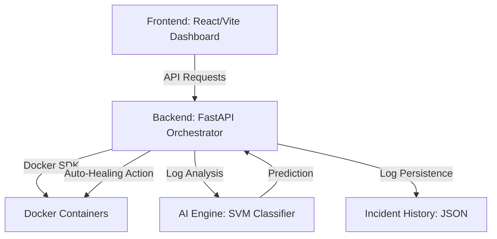

# 🛡️ AI-Powered Self-Healing Container Framework

An advanced, autonomous container orchestration layer that utilizes Machine Learning to detect, diagnose, and recover from container failures in real-time. By analyzing Docker metrics and log patterns, the framework can automatically apply specialized remediation steps—from simple restarts to complex network resets and resource throttling.

---

## ✨ Key Features

- **🚀 Real-Time Monitoring**: Live dashboard displaying resource utilization (CPU, Memory, Disk, Network) across all active containers.
- **🧠 AI-Driven Diagnosis**: Uses a multi-label SVM classifier to identify specific failure modes directly from raw log patterns.
- **⚡ Automated Recovery**: Autonomous execution of tailored fixes based on AI predictions (e.g., `LIMIT_RESOURCES`, `RESET_NETWORK`, `PURGE_LOGS`).
- **🛡️ Failure Simulation**: Integrated "Attack Simulation" engine to test system resilience against Fork Bombs, Memory Spikes, and Network Latency.
- **📊 Incident Logging**: Persistent history of all detected anomalies, AI confidence levels, and successful recovery actions.

---

## 🏗️ Project Architecture



---

## 🛠️ Tech Stack

- **Core**: Python 3.9+, Docker SDK
- **Backend**: FastAPI, Pydantic, Uvicorn
- **Frontend**: React 19, Vite, TailwindCSS, Lucide Icons, Axios
- **AI/ML**: Scikit-Learn (SVM Classifier, Isolation Forest), NumPy, Pandas
- **Testing**: Pytest

---

## 📁 Project Structure

```text
AI-Automation/
├── ai_engine/          # ML models, training scripts, and anomaly detection
├── backend/            # FastAPI source code, logic, and recovery engine
├── containers/         # Configuration for simulated target containers
├── data/               # Persistent logs, training datasets, and incident history
├── frontend/           # React dashboard source code
├── scripts/            # Utility scripts for starting servers and simulations
└── tests/              # Unit tests for the recovery and mapping logic
```

---

## 🚦 Quick Start

### 1. Prerequisites
- **Python 3.9+**
- **Node.js 18+**
- **Docker Desktop** (Ensuring the Docker daemon is running)

### 2. Installation

#### 🍎 macOS / 🐧 Linux
```bash
# Setup Backend
python3 -m venv venv
source venv/bin/activate
pip install -r backend/requirements.txt

# Setup Frontend
cd frontend && npm install
```

#### 🪟 Windows (Powershell)
```powershell
# Setup Backend
python -m venv venv
.\venv\Scripts\Activate.ps1
pip install -r backend\requirements.txt

# Setup Frontend
cd frontend; npm install
```

### 3. Running the Framework

| Service | macOS / Linux Command | Windows (Powershell) Command |
| :--- | :--- | :--- |
| **Backend API** | `./scripts/start_server.sh` | `python -m uvicorn backend.src.api:app --host 0.0.0.0 --port 8000 --reload` |
| **Frontend UI** | `cd frontend && npm run dev` | `cd frontend; npm run dev -- --port 5174 --host 0.0.0.0` |
| **Target Containers** | `./scripts/start_containers.sh` | `docker compose -f containers/docker-compose.yml up -d` |

---

## 🧪 Simulation & Testing

To test the end-to-end self-healing pipeline:

1.  Open the dashboard at `http://localhost:5173`.
2.  Select a container (e.g., `backend`).
3.  Choose a failure type (e.g., **Fork Bomb** or **Memory Spike**) and click **Simulate Failure**.
4.  Watch the **Healing Pipeline** log to see the AI agent detect the anomaly and apply the fix!

---

## 📈 ML Pipeline

The framework uses an SVM model trained on historical log data to predict specific actions. To retrain the model locally:

```bash
python3 ai_engine/train_model.py
```

Check the `Action Prediction Report` for accuracy metrics and the class distribution of fixes.
This was a very interesting take on the development pipeline fixes.

---
